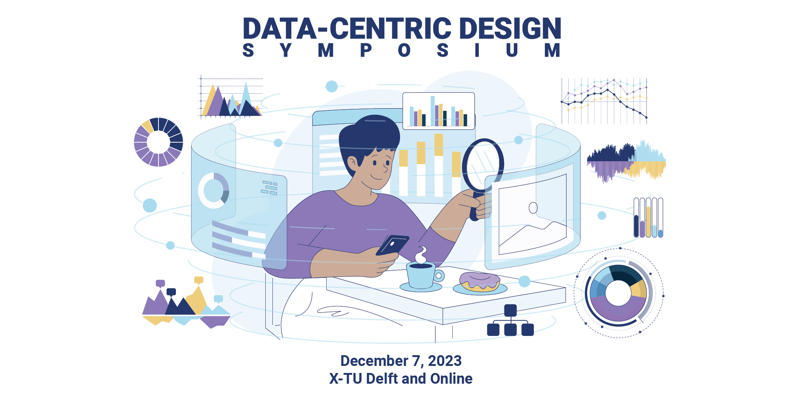

We invite you to the first Data-Centric Design Symposium on Data as Human-Centred Design material. The symposium will be held on **December 7, 2023, at [X, on TU Delft campus](https://www.tudelft.nl/en/x/) and Online**.

🎟️[Free registration](https://www.eventbrite.com/e/data-centric-design-symposium-tickets-694277642117) | 📢[Call for Participation](https://datacentricdesign.org/symposium#call-for-participation) | 📝[Program](https://datacentricdesign.org/symposium#program) | 📅[Save the Data (ICS)](public/dcd-symposium.ics)

You'll be able to join fellow human-centred researchers and practitioners to map perspectives and experiences on designing with data. **Data-Centric Design** leverages data as material for subjective inquiry, an entry point to better understand human dynamics through deeper reflection in a research or design process. In this context, data presents unique opportunities and challenges; practices have yet to emerge to understand how they transform the role and processes of researchers.

Scientists and practitioners from multiple disciplines will gather in Delft and online, building on the CHI Special Interest Group ['22](https://dl.acm.org/doi/10.1145/3491101.3516403) and ['23](https://dl.acm.org/doi/10.1145/3544549.3583180) on Data as Human-Centred Design Material and the international workshops and conversations gravitating around the topic. Nurturing the community, this community event aims at generating feedback and inspiration ahead of the call for papers for [Frontiers' Research Topic on Data-Centric Design](https://www.frontiersin.org/research-topics/58823/data-centric-design-data-as-a-human-centred-material) on February 25, 2024.

The symposium will showcase local and international research from academia and industry engaging with data for subjective inquiry through a rich programme of talks and interactivities.

Whether you're an experienced human-centred data practitioner or new to the community, the first Data-Centric Design Symposium is the perfect place to gain new insights, make valuable connections, and expand your horizons. Don't miss out on this incredible opportunity to be a part of the conversation to shape the effective and responsible use of data in human-centred design processes!

This program was initiated by the Data-Centric Design Lab of TU Delft Industrial Design Engineering in collaboration with TU Eindhoven Industrial Design, Cardiff University School of Computer Science and Informatics, and TU Chemnitz Chair Media Informatics. Our main sponsors are Open Science Community Delft and Frontiers.

# Program
 9:30 | Door opening | 
---|---|---
 10:00 | Opening | Jacky Bourgeois 
 10:10 | Keynote: Redesigning Spotify through Mixed-Methods Research | Ingrid Pettersson, Spotify, Sweden 
| 10:45 | Break| |
| 11:15 | **Conversation: Tangible Data, Tangible Design** | Host: Albrecht Kurze |
| | Data Portraits: Personal Journeys for Engaging with Urban Cycling Data | Xavier Barriga Abril (Online) |
| | Data Traces in the World and Their Impact on Data Physicalisation | Mary Karyda (In Person) |
| | ParticipAIte: Leveraging interactive prototypes for reflective critique on AI-enabled dataflows between qualitative citizen perspectives and quantitative representations in urban planning | Carissa Champlin (In Person) |
| | Tangible Consumption Data-Landscapes of Teenagers | Ayşe Özge Ağça (In Person) |
| | Exploring Dynamic and Uncertain Data Structures in Prototypes | Renata Dezso (In Person) |
| 12:00 | **Conversation: Storytelling x Data** | Host: Renée Noortman |
| | Thickening Agents: designerly engagements with sensor data | Dave Murray-Rust (In Person) |
| | Narrative Visualization of Self-Tracked Data: Bridging Personal Experiences with Data-Driven Well-being Support | Yvette Shen (Online) |
| | Data By Me, You, and Us: Exploring 'Transformable Data Literacy' through Data Embodiment for Behaviour Changes | Jihyun Park (Online) |
| | QuillGPT: Embodied Interaction with ChatGPT | Ahmet Börütecene (In Person) |
| 12:45 | Lunch | |
| 13:45 | **Conversation: Design Processes & Team Work x Data Practices** | Host: Peter Lovei |
| | Designing Human-Data Interaction Experiences in Colorectal Cancer Surgery Prehabilitation | Irina Bianca Serban (In Person) |
| | A review of Data-x Design and their activities in new product service development | Boyeun Lee (Online) |
| | Can you Hear(t) me? Using Expressive Biosignals to Change Observer's Empathy While Watching PoV Ethnographic Video | Wouter Meijer (In Person) |
| | Data as Design Material through the Lens of the Atlante Calvino Project | Miriah Meyer (In Person) |
| | A human-centered design approach in data-intensive settings - Challenges and best practices as Human Data Interaction experts | Sam Vonk (In Person) |
| 14:30 | **Conversation: Spaces, Tools and Skills** | Host: Alejandra Gomez Ortega |
| | Rollercoasters and Research: Applying Data-Enabled Design to an Amusement Context | Sujithra Raviselvam (In Person) |
| | The Walking Point: Inferences and techniques of human behaviour data in architecture practice | Angela Rout (In Person) |
| | Didactic considerations in data-centric design | Jonas Löwgren (Online) |
| | Reshaping Design Competencies: AI tools and Data-Driven Practices | Jonas Frich (In Person) |
| | Co-badge: Fostering Collaboration through a Data Badge Design Activity | Damla Çay (In Person) |
| 15:15 | Break |
| 15:45 | Panel Discussion |
| 16:45 | Closing and Drinks |

# Keynote: Redesigning Spotify through Mixed-Methods Research
### 10:10-10:45 | Ingrid Pettersson, Spotify, Sweden

Abstract

Launching radical changes to loved and habitually used features, used by millions every day, presents a challenge both to the end user and the organization making the change. Ingrid will present an overview of how Product Insights at Spotify work and an example of how data science and user research collaborated during the latest redesign of the mobile Library feature at Spotify. The challenge required a high degree of sensitivity to users’ needs within what is often considered their space in the world of streaming. Close collaboration between the product, design, engineering, data science, and user research disciplines, with a focus on quantitative and qualitative mixed methods insight work in early development phases, enabled the experience to be launched with the users’ experience at the forefront.

Ingrid's work focuses on user research and user experience design, with the ambition to understand user needs and pain-points to make everyday life with technology seamless, valuable, and enjoyable. She has nearly two decades of experience in the field, combining management and user experience research in industry and academic research. She strongly believes in the power of data-driven decision-making and driving user-centric initiatives in her role as User Research Manager at Spotify, where she has focused on the core mobile app and strategic partnership experiences.

# Conversation: Tangible Data, Tangible Design
### 11:00-12:00 | Session Chairs: Renée and Alejandra Gomez Ortega

## Data Portraits: Personal Journeys for Engaging with Urban Cycling Data
### Xavier Barriga Abril (Online)
**Pontificia Universidad Católica del Ecuador, Quito, Ecuador**

Abstract

A collection of virtual and physical data sculptures has been developed within the city, showcasing the movements of urban cyclists in Quito, Ecuador. These sculptures are the result of the creation of a set of interfaces designed for data collection (such as diaries and apps) and data representation (including digital maps and physical sculptures) within the city. This paper delves into the author's personal connection with the city through data. By documenting and mapping their most significant bicycle routes, the author creates a personal data-driven map using various tools. This methodology encourages an intimate relationship with data before entering collaborative environments, enabling deeper engagement with data and the critical examination of overarching trends.

## Data Traces in the World and Their Impact on Data Physicalisation
### Mary Karyda, Damla Cay, Kitti Butter (In Person)
**Moholy-Nagy University of Art and Design, Budapest, Hungary**

Abstract

The field of data physicalization has informed a plethora of instrumental and artistic physicalizations where data is represented in various forms and formats to elicit reflections building upon people's idiosyncrasies. While the meaning embedded in material structures is unique to individuals, we have yet to investigate what are the qualities and traits in physical data representations that are recurring. To explore this space, we conducted a study with 26 designers and artists who used data representations in their practice. Over three days, participants were sent prompts either via email or SMS to capture “data” around them via taking a picture with their phones and to complement that with a caption explaining their rationale. We received in total 64 pictures and their descriptions. The gathered materials indicated four categories: data narratives, patterned, pedagogic, and influential data forms. Our findings demonstrate a codependence between (1) physical data forms which are connected to personal experiences, habits, and emotions, and, (2) a collective understanding of data that is characterized by recurring themes such as patterns, flow, infinite, and influence. This work contributes theoretically by providing a lens that helps us unpack the codependence between the designer’s personal experiences and their role in data physicalization construction.

## ParticipAIte: Leveraging interactive prototypes for reflective critique on AI-enabled dataflows between qualitative citizen perspectives and quantitative representations in urban planning
### Carissa Champlin, Juliana Goncalves, Tomasz Jaśkiewicz (In Person)
**Delft University of Technology, Delft, The Netherlands**

Abstract

Developments in artificial intelligence (AI) promise to enable new forms of citizen engagement in decision-making processes shaping the future of cities. At the same time, the discourse on the use of AI in the smart city context warns of how the “black box” nature of AI may threaten to exacerbate already eroding trust in public authorities and institutions. This paper explores how this trend can be turned around through new forms of AI-driven participatory tools designed to collect and represent local values and knowledge of citizens. An interactive technology design installation called “ParticipAIte” was used to sensitize and engage diverse expert stakeholders in a discussion on opportunities and threats of these technologies. The installation created by TU Delft researchers and students for the City Climate meets Creative Coding Festival highlighted the flow of citizen-generated data from “neighbourhood buzz” into high-stakes municipal board room discussions. Two prototypes in the exhibit – Talk2 and Under the Loop – presented new interface possibilities for collecting citizen data in narrative and qualitatively-rich formats. A third prototype – kAIte - demonstrated how collected citizen input could be represented through AI-technologies in board room discussions. The hypothetical but scientifically backed case of planning for flooding in Rotterdam in the year 2070 connected the three prototypes. Based on feedback collected in an exit study from exhibit visitors, this paper brings together and analyses critical reflections on the potentials and pitfalls of AI-enabled technologies that support citizen participation in urban decision making.

## Tangible Consumption Data-Landscapes of Teenagers
### Ayşe Özge Ağça (In Person)
**Faculty of Humanities, University of Southern Denmark, Odense, Denmark**

Abstract

Young people are increasingly concerned about clean energy, and they play a crucial role in driving energy transition. In this study, I investigate how teenagers understand energy consumption, how tangible data-mapping may increase their awareness, and what ideas they may have about how to change habits. The study included briefings with warm-up exercises and 1-hour sessions in two primary schools with all 36 teenagers aged 14-16 years. I asked them to (1) fill in a questionnaire about their energy consumption habits; (2) make a layout drawing of their home showing the products that consume energy; and (3) build a physical model of their energy consumption. I call the physical model a ‘tangible consumption landscape’. It is made by weaving coloured paper strips into a checkered cardboard base. I video-recorded the teenagers’ explanations about their consumption habits. Based on the questionnaires, home drawings and consumption landscapes, I identify three types of awareness patterns emerging while the participants make sense together: The questionnaires initiate discussions about who consumes energy through which products in the home. The layout drawings indicate which products and rooms are the most energy-intensive. The consumption landscapes urge the participants to explore the perceptual integrity of specific energy-consuming habits and to notice ways of changing those patterns. The self-expressive sessions demonstrate that the three data-mapping techniques enable teenagers to recount their daily consumption patterns. In particular, the tangible mapping of data in consumption landscapes may increase their awareness of energy consumption and spawn responsibility for a change of habits.

## Exploring Dynamic and Uncertain Data Structures in Prototypes
### Renata Dezso (In Person)
**Moholy-Nagy University of Art and Design, Budapest, Hungary**

Abstract

This study focuses on the transformative role of digitally fabricated prosthetic prototypes characterized by their tangible and material nature. These prototypes transcend their role as mere experimental artefacts, and they serve as crucial links in the chain of knowledge development with a repository of empirical evidence data. The digitally created and experimentally tested data embedded in the prototypes play a pivotal role in stimulating critical reflection and fostering innovative insights concerning our value system, particularly in the context of human-centred societal challenges. Complex and fragmented social challenges are often ambiguous with high uncertainty and are difficult to define. Digital data in the objects encodes a tangible chain of information of a relational network within biological and artificial elements that morph and change in the continuously transactional activity with these boundary objects. The goal of designing an upper limb prosthesis for the artist Luca Szabados, led to several tangible prototypes assuming the role of 'boundary objects' in an argumentative co-design development facilitating the emergence of latent perspectives and insights. In the Research through Design (RtD) workflow, the probe and reprobe material data structure with dynamics and uncertainty triggers the domain of human experience, while the ontological structure of the world unfolds through interactions affected by the influential framework of critical disability studies. Transforming groups of datasets to be physicalized fast-prototyping proved to be a reliable instrument for mapping out and building up a view of co-Ability phenomenon.

# Storytelling x Data
### 12:00-12:45 | Session Chairs: Renée Noortman and Alejandra Gomez Ortega

## Thickening Agents: designerly engagements with sensor data
### Dave Murray-Rust, Jacky Bourgeois, Abhigyan Singh (In Person)
**Delft University of Technology, Delft, The Netherlands**

Abstract

Designers face increasing complexity in their design process. They are not designing products and their behaviors anymore, but for the impact these product behaviors have on their users and their environment. These are behaviors that users themselves need help understanding and misalign with their intentions. In addition, autonomous systems have evolving behaviors, requiring an understanding of how to feed and shape these systems and capture how users interact with these systems. In today's digital age, the omnipresence of data has yet to shape design, often viewing data merely as numerical values or isolated units that limit its potential. Instead, the true potential of data lies in its capability to act as a connective tissue, bridging experiences across diverse modalities. This connection becomes incredibly profound when we dive into finely-grained temporal data, offering insights into pivotal moments and elucidating the intricate relationships between people, products, and their broader socio-cultural milieu. This work extracts experiences from a series of design and research projects to shed light on "thickening agents, i.e., innovative practices that seek to enrich data, transforming it from mere numbers to meaningful narratives. By employing annotation, visualization, and participation techniques, we illustrate how researchers can lend depth, context, and richness to data. We combine design, Human-Computer Interaction, and anthropology perspectives to argue that there are opportunities to use thin data beyond blending as a human-centered material that can be thickened through an iterative process with annotations, visualizations, and participations.

## Narrative Visualization of Self-Tracked Data: Bridging Personal Experiences with Data-Driven Well-being Support
### Yvette Shen (Online)
**The Ohio State University, Columbus, United States**

Abstract

In the evolving landscape of self-tracking tools, raw data becomes truly transformative when presented as a holistic narrative. This study explores "Narrative Visualization," a method that melds storytelling techniques with data visualization, offering users a comprehensive view of their data-driven journey. Leveraging the story spine framework, complemented by thematic groupings and contextual markers, this approach underscores individual achievements, experiences, and patterns. By integrating principles of positive psychology, narrative visualization moves beyond just numbers to shed light on the human narratives underlying the data. This paper highlights narrative visualization's potential to shift the way individuals interpret and derive meaning from their self-tracked data, thereby enhancing self-awareness, fostering personal growth, and supporting an individual’s well-being.

## Data By Me, You, and Us: Exploring 'Transformable Data Literacy' through Data Embodiment for Behaviour Changes
### Jihyun Park (Online)
**Simon Fraser University, Burnaby, Canada**

Abstract

A conventional view of data often sees data as a separate entity from its creator or user. In this view, data is considered purely functionally via quantification, counting, and measurement. On the other hand, if we take a look at its etymology, data is a 'container' that accommodates a variety of elements which may include perspective, thoughts, and emotions that are not limited to factual information. This suggests that data can be subjective and transformative depending on the interpretation of creators and users. From this perspective, the role of a creator becomes important as well as the 'relationship' between data and a creator. This paper explores what aspects we need to consider when looking at data from a relational perspective. Shifting data from a factual concept to an experiential and cognitive concept, it examines how data can be continuously transformable by a creator's emotions, reflections, stories, and realizations. This paper presents an experiment that tracks individual plastic use by myself and with a group of people. It investigates how data influences changes in participants' awareness and behaviours through participants' reflective experiences of the data. By incorporating this approach into citizen-involved data practices, it seeks ways to amplify citizens' reflections on data in order to transform them into individual or collective actionable gestures toward a more sustainable community.

## QuillGPT: Embodied Interaction with ChatGPT
### Ahmet Börütecene, Eleanor Byrne (In Person)
**Linköping University, Linköping, Sweden**

Abstract

Can we create more embodied ways to interact with AI technologies and generate data-driven narratives about our relationship to our environment? Narratives are not created in a vacuum. The stories we tell are co-narrated in collaboration with our environment. We propose a design concept whereby the prompts fed to AI-text generator ChatGPT are generated by our tracked movements (e.g. GPS, temperature, and motion sensors) instead of the written word. We offer a concept video featuring a tracked bicycle ride through a city. Our concept has two components: a bike and a quill. The quill is a physical-digital object that represents the data collection artefact. This could be imagined as an artefact equipped with some sensors or an intermediary data-collection object that relies on the sensors in the mobile device (e.g. smartphone). The AI-text generator creates a story based on the data collected through our bicycle ride through the city. This invites us to reflect and ask questions about what our environment means to us. The quill can be used as part of a co-design process to elicit stories from different inhabitants in an urban environment. Designers and relevant stakeholders can use the stories as a way to reflect on alternative presents and futures of the city. This would be an invitation to reconsider meaning and significance in people’s habitual environments and beyond (e.g., what narratives might finding new neighbourhoods generate?) How do we interact with our environment now, and how might we want to in the future?

## Break

# Design Processes & Team Work x Data Practices
### 13:45-14:30 | Session Chairs: Peter Lovey and Mathias Funk

## Designing Human-Data Interaction Experiences in Colorectal Cancer Surgery Prehabilitation
### Irina Bianca Serban (1), Dimitra Dritsa (1), Israel Campero Jurado (1), Steven Houben (1), Aarnout Brombacher (1), David Ten Cate (2), Loes Janssen (2), Margot Heijmans (2) (In Person)
1. **Eindhoven University of Technology, Eindhoven, The Netherlands**
2. **Máxima MC, Eindhoven, The Netherlands**

Abstract

Prehabilitation for colorectal cancer (CRC) surgery is a multimodal lifestyle change program that prevents postoperative complications. While telemonitoring (TM) during prehabilitation is still in its infancy, this technology is currently being explored to build an understanding of patients’ lifestyles outside the clinic. However, one prevalent design problem is fitting TM systems in clinicians’ existing workflows without disrupting or creating more work. In this study, we investigate how data from a TM system tracking patient physical activity, sleep, and stress fit into the workflow of different prehabilitation clinical specialties. Building on a previous study, we present findings from 7 workshops conducted with clinicians with different specialties, such as psychology and oncology. Our findings highlight aspects such as the complexity, diversity and temporality in the needs of different specialists, and the social dimensions of data sharing. While these findings indicate that aligning the diverse data needs in the same decision-support system is a difficult task, they also show that human-data interaction experiences can bring significant value in clinician-patient interactions beyond optimizing the prehabilitation program, while also having the potential to establish a bridge between the prehabilitation and rehabilitation pathways. We also reflect on approaches to co-creating human-data interaction experiences that we used in this case study, and experiences related to the difficulties of discussing data needs with stakeholders that have varying levels of data literacy.

## A review of Data-x Design and their activities in new product service development
### Boyeun Lee, Saeema Ahmed-Kristensen (Online)
**University of Exeter, The United Kingdom**

Abstract

In the era of Industry 4.0, characterized by the stimulation of digitalization through the Internet of Things (IoT), Big Data, and machine learning technologies, a growing volume of valuable data is being acquired from sensors and interconnected devices. Industry practitioners are captivated by this data-driven paradigm, which can efficiently, effectively, and creatively support designers in developing new products and services. Consequently, scientific research addressing Data-x design has steadily increased in recent years. With the aim of deepening the understanding of data as a critical resource for creating new products and services, we conducted a systematic literature review and questionnaire survey. This study has two primary objectives: (a) synthesizing various existing concepts data-x design to comprehend the relationships between different approaches, contributions, and their data usage, and (b) identifying and validating data-driven design activities and the types of data associated with each activity to create a comprehensive framework. The key findings highlight the relationship between commonly used concepts for integrating data into product service development (i.e., data-driven, data-enabled, data-centric, data-aware, data-informed, and design analytics) and their distinctions. This study contributes by introducing a Data-Driven Design Framework, which identifies seven data-driven design activities. This framework aids practitioners in understanding which data-driven design activities are appropriate for their project and how data or machine learning could be used for each activity. This systematic literature review enhances the body of knowledge on data-driven design by presenting an integrated theoretical framework for the role of data and data analytics in the development of products and services.

## Can you Hear(t) me? Using Expressive Biosignals to Change Observer's Empathy While Watching PoV Ethnographic Video
### Wouter Meijer, Himanshu Verma, Jacky Bourgeois, Gerd Kortuem (In Person)
**Delft University of Technology, Delft, The Netherlands**

Abstract

Point of View (PoV) video ethnography provides a detailed perspective on user experiences, but lacks social cues. Studies have demonstrated that incorporating "Expressive Biosignals" enhances interpersonal empathy in situations where social signals are limited. In this study, we investigated the effect of Expressive Biosignals on observer empathy via a between-subjects design. Forty-five participants viewed a point-of-view video of a bike ride under one of three conditions: standard video, video accompanied by a heart rate graph, and video with audible heartbeats. Results indicate that the audible condition significantly decreases the mean error of the observer's valence prediction for the cyclist. Follow-up analysis revealed a correlation between the Measure of State Empathy and empathy factors examined in Design Research. Additionally, it indicated that observers established a more profound connection with subject emotions. These findings demonstrate how the audible condition modifies observer empathy, aligning empathy in both HCI and Design Research.

## Data as Design Material through the Lens of the Atlante Calvino Project
### Miriah Meyer (In Person)
**Linköping University, Linköping, Sweden**

Abstract

Framing our interactions with data as a process of design-after-design, Feinberg argues that data is a material continually in the making [1]. A provocative glimpse into the potential of this perspective is the collaborative work of designers and literary scholars who created visualizations in support of literary critique of the Italian writer Italo Calvino [2][3]. The designers’ creation of an iterative process for the literary scholars to manually refine data visualizations challenges us to accept that the design of data can go beyond designing the data infrastructures – the collection, representation, and aggregation of data – to actually designing the values themselves. Furthermore, the iterative, manual refinement process – a literal example of design-after-design – was a rich source of insight and learning for the scholars, questioning whether it was the final visualization, or the journey to get there, that was really the point. This case study is an opportunity to push our ideas of data as a design material beyond the design of data infrastructures, and to instead think about what it means to take a designerly way of knowing *through* the design of data. It surfaces questions about the inseparability of data and its visual form; about whether we are designing artifacts or experiences; and how we position non-digital and physical visualizations within normative expectations of data analysis.
1. Feinberg, M., 2017, May. A design perspective on data. In Proceedings of the 2017 CHI Conference on Human Factors in Computing Systems (pp. 2952-2963).
2. Elli, T., Briones Rojas, M., Gobbo, B., Parigini, M., Giustetto, V., Cavalloro, V. and Mauri, M., 2021. Metaphors as Knowledge Activators in Data Visualizations: the case of the Archipelago of Calvino's literary works. In CUMULUS CONFERENCE PROCEEDINGS SERIES (Vol. 2, pp. 906-924). Aalto University.
3. https://atlantecalvino.unige.ch/

## A human-centered design approach in data-intensive settings - Challenges and best practices as Human Data Interaction experts
### Sam Vonk, Wisse van Woerkom (In Person)
**Brightcape, The Netherlands**

Abstract

Today we see the growing emphasis on user experience (UX) across various industries. More companies are prioritizing their users, yet in intricate and data-intensive settings, a human-centered approach often remains absent. This is precisely where our expertise in Human Data Interaction (HDI) becomes crucial. As HDI experts, we ensure that individuals comprehend data, its context, and its repercussions. This allows people to interpret and use the information presented to them effectively to drive decisions. One notable instance demonstrating our effectiveness occurred in a project at ASML. A significant segment of ASML employees needed control over the quality of new products during their development. Presently, acquiring the necessary insights is arduous due to a fragmented data landscape and the absence of a standardized solution. Through collaboration between our HDI specialists, data engineers, data analysts, architects, and a client product owner, a dashboard rooted in reliable datasets was crafted. This dashboard offers flexibility for metric-specific requirements and enables users to delve into various perspectives. It accommodates diverse user groups throughout the organization. However, this substantial project presented challenges. For instance, determining the most effective way to cater to distinct user groups, each with unique objectives and information needs. We are eager to discuss these challenges with you and share our best practices, including the processes and methods we employed to arrive at our solution.

# Spaces, Tools and Skills
### 14:30-15:15 | Session Chairs: Alejandra Gomez Ortega and Sandy Gould

## Rollercoasters and Research: Applying Data-Enabled Design to an Amusement Context
### Sujithra Raviselvam (1), Peter Lovei (1), Renee Noortman (1), Thomas Olsson (2), Kaisa Väänänen (2), Mathias Funk (1) (In Person)
**(1) Eindhoven University of Technology, Eindhoven, The Netherlands**
**(2) Tampere University, Tampere, Finland**

Abstract

Data-Enabled Design (DED) is a design approach where research data is integrated with design praxis in an iterative and hands-on fashion, and it has been successfully applied to design for people in the healthcare domain. However, how to use the approach in non-medical contexts such as public spaces, entertainment and generally to design for larger populations remains an open question. Understanding the advantages as well as the challenges of applying DED to such contexts is crucial to further guide design researchers and prevent methodological mismatches. In this article, we report on applying DED in an open, semi-public context with a large population of visitors, where one has minimal control over the data gathered from people in context. We present the findings from a design workshop with 16 participants who were well-versed in design thinking and Human-Centred Design (HCD) methods and processes. The workshop was held in collaboration with one of the largest amusement parks in Finland. Using design proposals and reflections from five student teams we investigate the use of DED in this context, reporting on perceived challenges, barriers, successes and future directions for taking DED into similar (semi-)public contexts. We conclude with a reflection from a workshop organizer’s point of view and also share the feedback from our industry collaborator, highlighting the factors that complimented DED.

## The Walking Point: Inferences and techniques of human behaviour data in architecture practice
### Angela Rout, Marija Mateljan, Dennis Pohl (In Person)
**Delft University of Technology, Delft, The Netherlands**

Abstract

"A line is a point that went for a walk" - Paul Klee It is a simple gesture; to draw a line over a map and say: “this is the way we walk”. And while this gesture has been used for centuries to articulate human movement trajectories on maps - how does this line translate to the domain of architecture, where the surface is no longer a map, but a floor plan? This presentation examines the point-walking-across-a-floor-plan as a means to represent and record information about human travel and experience, through data, representation, and design. In data collection and analysis, lines: a sequence of connected points, are loaded with assumptions about human behaviour and occupancy. In visual representation, architects use various visual techniques when drawing lines-as-trajectories to express meta information about human experience. During design, architects interpret the point-walking-across-a-floor-plan in three (sometimes four) dimensions, and then configure new spaces, based on a line’s trajectory. In this study, we explore the techniques and the related inferences of behaviour data through examination of text and images in architectural literature. We then conduct interviews with architects to understand how the visual representation of a line-as-trajectory is interpreted by practising architects. This research has implications for data visualisation, digital tools, and decision support for building designs that better respond to human behaviours and occupancy.

## Didactic considerations in data-centric design
### Jonas Löwgren, Miriah Meyer, Niklas Rönnberg, Katerina Vrotsou (Online)
**Linköping University, Linköping, Sweden**

Abstract

Data-centric design is a relatively new addition to the academic research and teaching landscape. We consider it to be an inherently multidisciplinary subject, combining bodies of knowledge from media technology, communication design and reflective/critical perspectives. Practicing, researching, and teaching data-centric design is challenging in an environment characterized by monodisciplinary research silos and short, parallel monodisciplinary courses, as in many technical universities. To foster meaningful learning for beginning students as well as collaboration between teachers, we are **planning a multidisciplinary undergraduate program drawing on principles** from design studio learning and problem-based/project-based learning. The organizing principle is a series of full-time thematic projects in data-centric design, each requiring the appropriation, use and above all synthesis of technical knowledge, design knowledge and reflective/critical knowledge. Teaching takes place in a studio-like setting where teachers support the students in developing skills and generative repertoires as well as reflective/critical perspectives. In our current plans, the first semester is dedicated to Visual Media Design with projects in physical data visualization, informative visualization, expressive visualization, and visualization for the public. The second and third semester address Data and Analysis and Multimodal and Hybrid Spaces, respectively. Integrated teaching of technical, design and reflective/critical knowledge is comparatively uncharted territory. How much math and programming are enough? What kinds of non-digital modalities might allow students to work with data in meaningful ways without grappling with technical barriers? How does data disrupt (or not) traditional design pedagogy? This kind of questions will be explored in the development of the new undergraduate program.

## Reshaping Design Competencies: AI tools and Data-Driven Practices
### Jonas Frich (In Person)
**Aarhus University, Aarhus, Denmark**

Abstract

Data-centric design approaches are increasing and are widely adopted in technology-focused companies [1, 2, 3]. The addition of data approaches to design is cherished for doing away with opinions [4] or encouraging innovation through experimentation [4, 5]. Furthermore, it has been claimed that data can play different roles in the design process in the form of a “material”, as added awareness, or as a leading and making decisions [1]. On the other hand, recent research has indicated a wide array of challenges regarding the uptake of data-centric design approaches which pertains to skills, confidence mindsets and ethics [6, 7, 8]. Recent works [1,2] have employed a dichotomous depiction of data and design to illustrate some of these challenges; On one hand data is rational, rigorous, reductive and deals with the already existing, whereas design is reflective, creative, empathetic and deals with the unknown or to-be-realized. Following these lines of research, **I propose that in order for data to foster creativity in the design process, new tools and competencies for designing with data are required**. This idea is consistent with theories of creativity e.g. by Amabile [9] who posits that a key component in creativity is domain-relevant skills. Rapidly advancing AI tools have the potential to bridge the potential skill-gap for working with data, and recent studies [10,11] further indicated that these tools act as an impressive skill-leveler for knowledge and creative work. This paper discusses the perspectives on using AI tools for specific data-centric design activities.
1. Van Kollenburg, J. and Bogers, S.. Data-enabled design: a situated design approach that uses data as creative material when designing for intelligent ecosystems. 2019
2. King, R., Churchill, E. F., & Tan, C. (2017). Designing with data: Improving the user experience with A/B testing. " O'Reilly Media, Inc.".
3. Chang, Y. H. (2021). Design for information flow between data scientists and researchers in Ford.
4. Kohavi, R., Henne, R. M., & Sommerfield, D. (2007, August). Practical guide to controlled experiments on the web: listen to your customers not to the hippo. In Proceedings of the 13th ACM SIGKDD international conference on Knowledge discovery and data mining.
5. Eisenmann, T. R., Ries, E., & Dillard, S. (2012). Hypothesis-driven entrepreneurship: The lean startup. Harvard business school entrepreneurial management case.
6. Briard, T., Jean, C., Aoussat, A., & Véron, P. (2023). Challenges for data-driven design in early physical product design: A scientific and industrial perspective. Computers in Industry
7. Lu, J., Gomez Ortega, A., Gonçalves, M., & Bourgeois, J. (2021). The Impact of Data on the Role of Designers and Their Process. Proceedings of the Design Society,
8. Ortega, A. G., Bourgeois, J., & Kortuem, G. (2023). Understanding the Challenges around Design Activities that Incorporate Behavioral Data. Proceedings of the Design Society.
9. Amabile, T. (2011). Componential theory of creativity (pp. 538-559). Boston, MA: Harvard Business School.
10. Dell'Acqua, F., McFowland, E., Mollick, E. R., Lifshitz-Assaf, H., Kellogg, K., Rajendran, S., ... & Lakhani, K. R. (2023). Navigating the Jagged Technological Frontier: Field Experimental Evidence of the Effects of AI on Knowledge Worker Productivity and Quality. Harvard Business School
11. Doshi, A. R., & Hauser, O. (2023). Generative artificial intelligence enhances creativity. Available at SSRN.

## Co-badge: Fostering Collaboration through a Data Badge Design Activity
### Damla Çay, Maria Karyda, Kitti Butter (In Person)
**Moholy-Nagy University of Art and Design, Budapest, Hungary**

Abstract

As visualization tools become widespread across various disciplines and among non-visualization experts, there's a rising need for methods that enhance creative collaboration in data visualization. Constructive visualization utilizes intuitive knowledge of physical building blocks to empower non-experts to create unique visualizations. Previously, data badges—a form of constructive visualization—have been utilized where participants constructed physicalizations individually, with predefined data dimensions. In this paper, we introduce Co-Badge, a 90-minute design activity where participants collaboratively construct visualizations by ideating and prioritizing relevant data types, mapping them to visual variables, and constructing data badges with stationary materials. We conducted three workshops in diverse settings (summer school, university onboarding day, and team-building event) with participants of different backgrounds. Our findings indicate that Co-badge facilitates a playful and engaging way to gain initial insights into the stages of data visualization while navigating the challenges of collaborative data visualization. Through this activity, participants became aware of the key aspects of visualization without a formal introduction, such as the importance of appropriately matching data types with visual variables and avoiding oversimplification. Our work contributes to the field of data-centric design by highlighting the significance of collaboration in engaging with data. We believe Co-Badge can serve as an effective ice-breaker and educational tool that introduces fundamental concepts of data visualization and collaboration, ultimately enhancing the quality of collaborative data visualization projects.

## Break
# Panel Discussion

Closing at 17:00 with networking and drinks

# Call for Participation

## Important dates
- Abstract submission: October 25 AoE
- Notification of acceptance: November 10 AoE
- Symposium: December 7

For this first Data-Centric Design Symposium, we want to gather perspectives from the community. We invite human-centred researchers to share their unique perspectives, knowledge, and experiences in designing with data.

Whether you are a doctoral researcher, faculty member, or practitioner, we believe your voice and expertise will enrich the symposium's discourse and help identify the opportunities and challenges in using data as material for subjective inquiry.

We welcome abstracts in the following areas
- Experience in using data as design material
- Collaboration around and through data
- Responsible data practices in design and research
- Tools and competencies for designing with data
- Data to foster creativity in the design process
- Participatory, co-creative and human-centred approach with data
- Data to foster creativity in the design process
- Expressive and tangible interaction with data
- Reflexive mechanisms to understand the impact of data on human behaviour
- Feminist Data Practices

**Selection Process**: We invite you to submit an abstract to the Frontiers Research Topics 'Data-Centric Design'. The guest editors (symposium organisers) will review your proposal, and acceptance notifications will be sent out by **November 10**. The acceptance of your abstract is an invitation to submit a full manuscript for peer review.

**At the symposium**: each accepted abstract contributor will have the opportunity to present their work and perspective in person or online.

**After the Symposium**: we will invite authors of all accepted contributions to extend their contribution into a full paper and submit their work to the Research Topic 'Data-Centric Design' of the Frontiers journal on 'Human Dynamics'. See the [open call for February 25, 2024](https://www.frontiersin.org/research-topics/58823/data-centric-design-data-as-a-human-centred-material).

**Submission Details**: please visit our [Research Topic webpage](https://www.frontiersin.org/research-topics/58823/data-centric-design-data-as-a-human-centred-material) and complete the online submission form with a **250-word abstract**. The deadline for submissions is **October 25, 2023**. 

# Organisers

Contact us at [symposium@datacentricdesign.org](mailto:symposium@datacentricdesign.org)

- [Jacky Bourgeois](https://jackybourgeois.com), TU Delft (NL)
- Mathias Funk, TU Eindhoven (NL)
- Sandy Gould, Cardiff University (UK)
- Albrecht Kurze, Chemnitz University (Germany)
- Alejandra Gomez Ortega, TU Delft (NL)
- Peter Lovei, TU Eindhoven (NL)
- Renee Noortman, TU Eindhoven (NL)

# Sponsors

